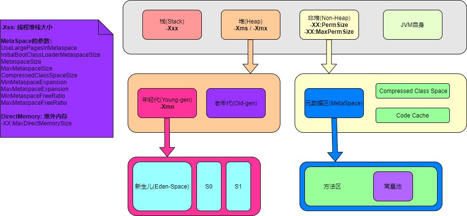

# 作业

1. 自定义一个 Classloader，加载一个 Hello.xlass 文件，执行 hello 方法，此文件内容是一个 Hello.class 文件所有字节（x=255-x）处理后的文件。文件群里提供。

    - 自定义ClassLoader：[HelloClassLoader.java](./week-01/src/main/java/com/xiqiang/week01/HelloClassLoader.java)
    - 测试类：[TestHelloClassLoader.java](./week-01/src/main/java/com/xiqiang/week01/TestHelloClassLoader.java)

2. 画一张图，展示 Xmx、Xms、Xmn、Meta、DirectMemory、Xss 这些内存参数的关系。

    

# 学习笔记

